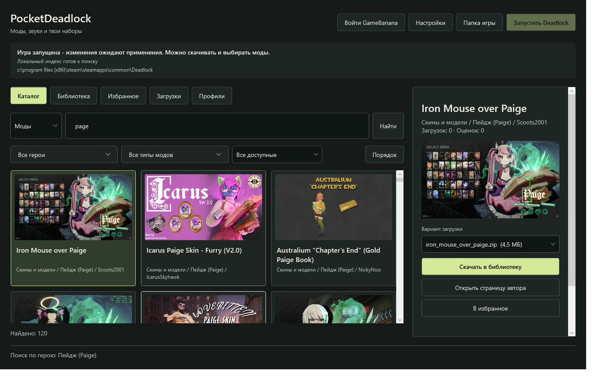

# PocketDeadlock

**Your Deadlock mods. One native Windows app.**

Find mods, keep a local VPK library, and share your loadout with a key.

**[Download for Windows x64](https://github.com/AlexUner/pocket-deadlock-mod-manager/releases/latest)** · [Player guide](docs/guide.md) · [Report a bug](https://github.com/AlexUner/pocket-deadlock-mod-manager/issues/new/choose)

English · **[Русский](README.ru.md)**

---

PocketDeadlock is an open-source **Deadlock mod manager for Windows**, built with C# and WPF. Browse GameBanana and community catalogs in one feed, choose variants, arrange your mods, and apply a set when the game is closed. Russian and English, plus light and dark themes, follow Windows preferences by default.

*Catalog preview from 0.6. The current release also adds the app-update control and tile statistics. Mod images belong to their respective creators.*

## What you can do

| Workflow | Features |
| --- | --- |
| **Find a mod** | One catalog combining GameBanana, Deadlocker and DeadlockMods. Hero, mod-type and content filters, favorites, and direct GameBanana links. |
| **Keep browsing** | Continuous cover tiles, lazy images, background indexing and cached local search. Try `Paige`, `page` or `пейдж`. |
| **Build your set** | Download variants or import VPK / ZIP / RAR / 7Z. Select files, change priority, and inspect resource overlaps before applying. |
| **Share a loadout** | Local profiles and self-contained `PD1` keys. Restore referenced variants and ordering without a profile-hosting service. |
| **Keep mods current** | Update the selected variant, keep previous revisions, and roll back. Ambiguous replacements need your choice. |
| **Update the app** | Startup and manual checks, signed update metadata, package checksums, and install-and-restart. |

GameBanana login happens on the official website in an embedded browser. A connected account can access content permitted by its source settings. Library and profile use do not require a PocketDeadlock account.

**↓** means downloads; **★** means the source's likes count, not a five-star review score. A dash means the source did not provide the number.

## Get started

**You need:** Windows x64, Steam and Deadlock. Releases include the .NET runtime. GameBanana sign-in additionally needs the [Microsoft Edge WebView2 Runtime](https://developer.microsoft.com/en-us/microsoft-edge/webview2/).

1. [Download the release ZIP](https://github.com/AlexUner/pocket-deadlock-mod-manager/releases/latest) and extract **the whole archive** into a writable folder. Keep the EXE and neighboring files together.
2. Run `PocketDeadlock.exe` and check the detected game folder.
3. Download a mod into **Library**, or import a VPK / archive. Enable the desired mods and arrange their priority.
4. Close Deadlock, click **Apply selected mods**, then launch the game through Steam.

Selection changes stay pending until Apply. Apply, Disable and Launch are blocked while Deadlock is detected as running. Adding a mod to the library does not immediately change the game.

[Full setup and recovery guide](docs/guide.md) · [Русская инструкция](docs/guide.ru.md)

<strong>How app updates work</strong>

Check the manager with **Updates** beside its version. Mod updates have a separate control in Library. Prepared app updates install on close or with **Install and restart**.

## Why PocketDeadlock?

This project started after an antivirus warning interrupted the existing mod-management setup. Its focus is a native Windows workflow for finding, selecting and maintaining ready-made mods.

- **A local search index:** repeat searches use saved metadata while the catalog refreshes in the background.
- **A loadout contained in a key:** sharing does not upload the profile to our server. Downloading its mods still needs the source websites.
- **Visible changes and recovery:** separate selection from application, retain mod revisions, and back up game configuration before changing it.

[Deadlock Mod Manager](https://github.com/deadlock-mod-manager/deadlock-mod-manager) offers a broader ecosystem, including Linux packages and extra tools. Profiles, browsing and updates are shared capabilities. See the [dated comparison with source references](docs/comparison.md).

## Antivirus status

For **0.6.6**, a Kaspersky 21.26 scan reported **0 detections across 413 objects**. Normal startup and the real **0.6.2 → 0.6.6** update were checked on one Windows computer with no active exclusions or trusted-app rules. No new Kaspersky detection was observed in those workflows.

An earlier developer diagnostic process triggered `PDM:Trojan.Win32.Generic`. It has not been classified as a false positive by Kaspersky. Ordinary release builds exclude that diagnostic code. Update-feed signatures are **not Windows Authenticode certificates**.

These are results for a specific package and limited workflows, not antivirus certification. [Scan, hash and reporting guidance](docs/antivirus.md) · [Original verification record in Russian](Проверка.md)

## Scope and privacy

- **Windows x64 only.** No Linux/macOS build, crosshair editor, VPK authoring, plugins or cloud profile storage.
- **VPK mods only.** Split VPKs, executables, scripts and loose configurations are not installed automatically. Community-only listings may require downloading on the source page and importing the archive.
- **Local data:** `%LOCALAPPDATA%\PocketDeadlock`. The GameBanana session is encrypted for the current Windows user. The manager uses its own embedded-browser profile.
- **Scoped game changes:** copies in `game/citadel/pocket_mods` and a marked block in `gameinfo.gi`. Existing `addons` and unrelated mounts are preserved. Conflict detection covers the selected PocketDeadlock set.

Catalog availability and each mod's compatibility depend on their authors and providers. The project is independent of Valve and the catalog providers.

## Documentation and contributions

| Looking for… | Start here |
| --- | --- |
| Installation, accounts, profiles, updates and removal | [Player guide](docs/guide.md) / [Русская инструкция](docs/guide.ru.md) |
| Comparison with Deadlock Mod Manager | [Comparison](docs/comparison.md) / [Сравнение](docs/comparison.ru.md) |
| Build, architecture and release workflow | [Development](docs/development.md) |
| A fix, translation or feature contribution | [Contributing](CONTRIBUTING.md) |
| A bug or question | [Support](SUPPORT.md) |
| A security vulnerability | [Security policy](SECURITY.md) |

GitHub Actions builds Windows packages, runs isolated checks and validates the release archive. Stable releases ship the ZIP, `SHA256SUMS.txt` and an ECDSA-signed `update-feed.json` together. Private keys and user data are excluded.

**MIT licensed:** [LICENSE](LICENSE). Thanks to mod authors, [GameBanana](https://gamebanana.com/), [Deadlocker](https://deadlocker.net/), [DeadlockMods](https://deadlockmods.app/), [SharpCompress](https://github.com/adamhathcock/sharpcompress) and Microsoft WebView2. Mods retain their authors' licenses.
