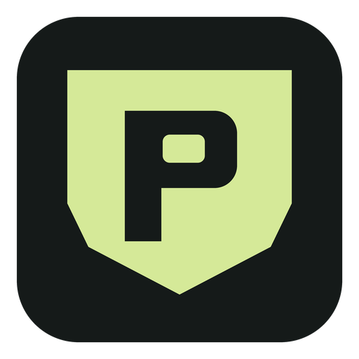
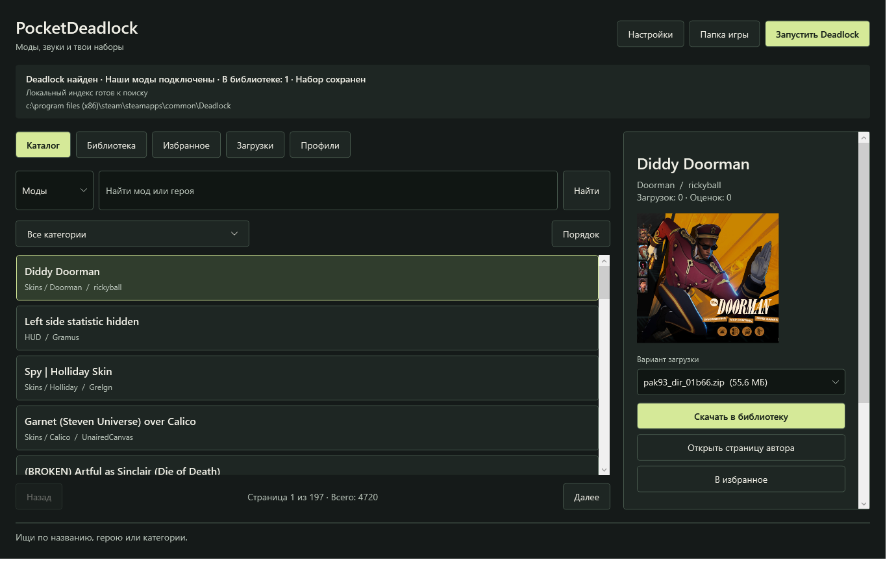
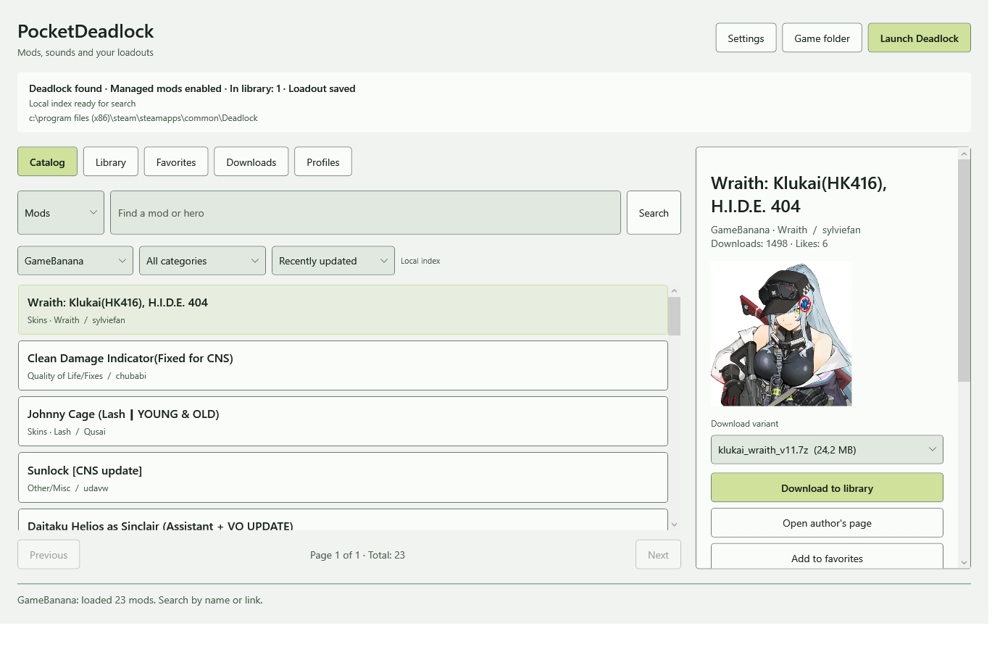
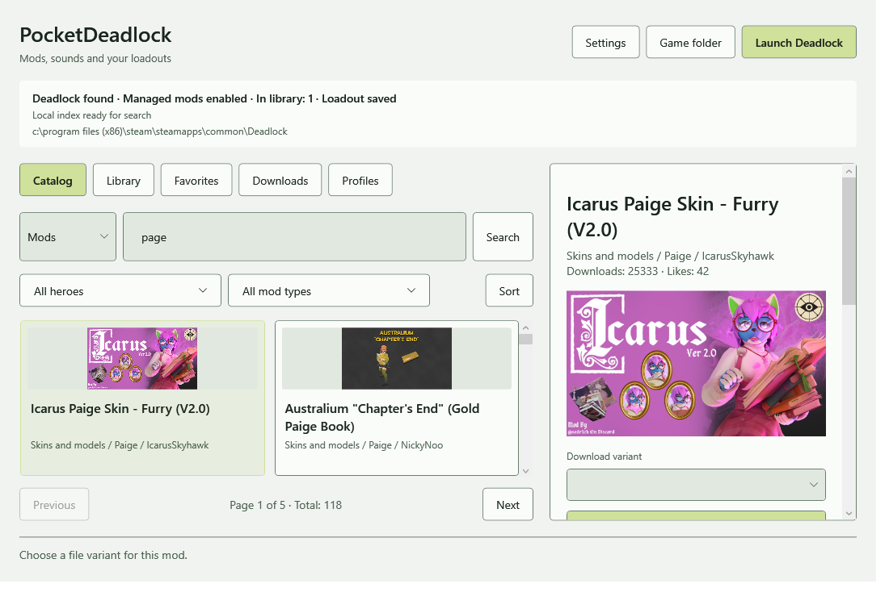
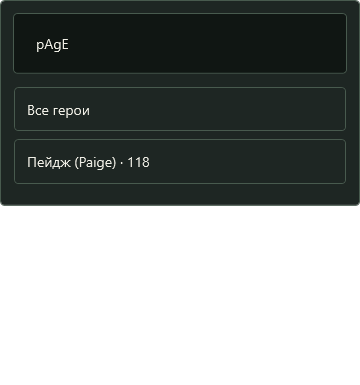
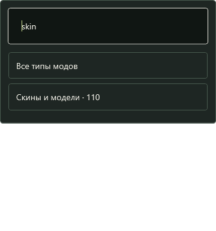
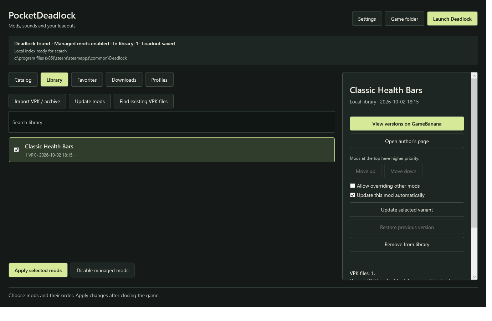
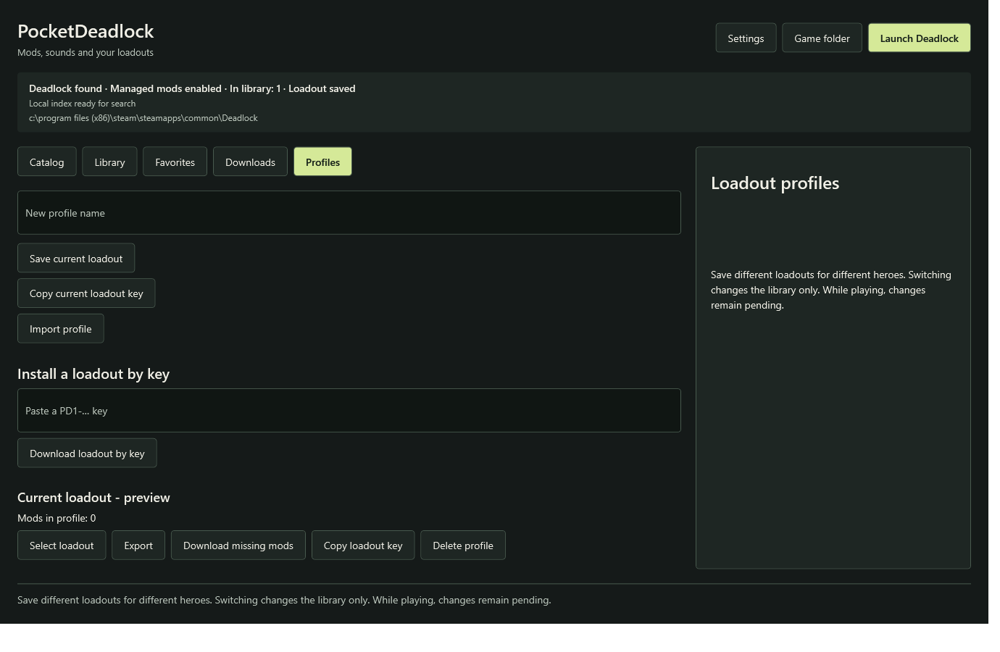

# PocketDeadlock - Deadlock Mod Manager for Windows



[](https://github.com/AlexUner/pocket-deadlock-mod-manager/actions/workflows/build.yml)
[](https://github.com/AlexUner/pocket-deadlock-mod-manager/releases/latest)
[](https://github.com/AlexUner/pocket-deadlock-mod-manager/releases)
[](LICENSE)

A native Windows x64 tool for finding Deadlock mods, managing a local VPK library, and switching mod sets. Built with C# and WPF. Independent of Valve, GameBanana, Deadlocker, and DeadlockMods.

[Download the latest release](https://github.com/AlexUner/pocket-deadlock-mod-manager/releases/latest) · [Русская инструкция](#русская-инструкция)

Version 0.6 is under review. A developer UI-check process triggered Kaspersky System Watcher on October 3, 2026. The new build is not being published to the signed update channel pending investigation. Diagnostic checks and image capture are now excluded from the ordinary build. Ordinary startup has been checked with an application trust rule configured by the owner; this does not establish antivirus acceptance without that rule. See [verification status](Проверка.md).



<details><summary>English light theme, library and loadout keys</summary>








</details>

## Features

- **Infinite cover feed:** Catalog, search and Favorites use an adaptive image grid without page buttons. The saved index exposes every matching result while the panel creates only visible tiles and two upcoming rows. Covers are prefetched with four simultaneous requests and memory/disk caching. A new search resets scrolling; background indexing retains the visible anchor. Details and file variants load on selection.
- **GameBanana account:** log in or sign up on the official website inside an embedded WebView2 window, then connect the account. The manager verifies the session with GameBanana, encrypts it for the current Windows user, and sends cookies only to the HTTPS GameBanana website. Passwords are entered on the website. Log out to remove the saved session. Filter All available, Regular content or Sensitive / NSFW independently of hero and mod type. Hidden entries require a connected account; access still depends on the source and account settings.
- **One combined catalog:** GameBanana, Deadlocker, and DeadlockMods work behind the scenes. Origin IDs remove duplicate listings while retaining community-only mods. Hero/type/content filtering and sorting cover the entire combined index.
- **Hero and mod-type filters:** choose a hero and independently choose skins/models, interface, effects, weapons, music, voices, or another type. Both pickers include search, counts, Down/Enter selection and Escape. Type counts follow the selected or searched hero; Reset clears both filters. Sorting is in the small **Sort** menu.
- **Hero-aware local search:** `page`, `Paige` and `пейдж` recognize Paige, including mods whose title omits the hero. Russian names and common aliases are supported for the recognized hero roster. A saved disk index, background startup refresh and debounced search keep repeated queries local. Fresh GameBanana rows are merged, then filtered by indexed title, author, hero and type metadata; unrelated full-text hits cannot bypass relevance. Paste a GameBanana URL to open it directly.
- **Local library:** import VPK, ZIP, RAR, or 7Z; drag files into the window; choose VPK files inside archives; copy selected old VPK files from the game's `addons` folder.
- **Downloads and favorites:** two simultaneous transfers, cancellation, saved operation history, and local favorites.
- **Priority and overlaps:** enable mods, reorder by dragging or Move up/Move down, and explicitly permit a higher-priority mod to override overlapping game resources. Root README, LICENSE and similar documentation files do not cause conflicts; nested text files and configurations still do.
- **Profiles:** save and switch sets; import/export JSON; copy a `PD1-...` key to restore a catalog-backed set on another computer, preserving order, variants, selected VPK paths, and override choices.
- **Mod updates:** preserve the chosen variant, retain previous revisions, and roll back. Ambiguous replacements require manual selection; rollback disables that mod's automatic update option.
- **Game integration:** detect Steam libraries, choose a folder, apply or disable the manager's set, and launch through Steam. Apply, Disable, and Launch are blocked while Deadlock is detected as running.
- **App updates:** the default GitHub feed uses ECDSA release signatures and SHA256 package checks. Verified updates are staged and installed when the manager closes.
- **Language and theme:** Russian and English, light and dark. Defaults follow Windows; non-Russian system languages use English. Preferences can be changed in Settings.

Community entries with a GameBanana origin obtain current details and direct download files there. Community-only entries require downloading from their source page and importing the file. Catalog coverage depends on the providers; the saved index is not a complete mirror of every mod.

## Quick start

1. Download and extract the whole Windows release archive into a writable folder. Keep the EXE and neighboring files together.
2. Run `PocketDeadlock.exe`. A self-contained release does not require a separate .NET runtime.
3. Check the detected folder. Use **Game folder** to select the Deadlock root if needed.
4. Find a mod in **Catalog**, choose its download file, and click **Download to library**. For multiple VPK choices, select the intended files. You can also use **Import VPK / archive** in **Library**.
5. In **Library**, enable the desired mods and arrange their order. Higher entries have higher priority. For an intentional overlap, allow the higher-priority mod to override others; otherwise disable one conflicting mod.
6. Close Deadlock and click **Apply selected mods**. New imports are disabled by default. Selection, priority, and profile changes do not immediately change the applied files.
7. Click **Launch Deadlock**. By default, the selected set is applied before launching; change this in **Settings** if needed.

**Ctrl+F** focuses search. **Escape** cancels a foreground operation; use **Downloads** to cancel individual transfers.

## Transfer a profile

Save the current set in **Profiles**, then use **Copy loadout key**. On another computer, paste the `PD1-...` key and choose **Download loadout by key**. The manager downloads available matching GameBanana variants and selects the restored set. Apply while the game is closed.

A key contains references and settings, not mod files or cloud storage. It includes enabled catalog-backed entries. Enabled local-only VPK files block key creation: transfer those files separately and import them, or disable them before creating a key. JSON export can record local entries but also excludes file content. Removed or ambiguous remote variants need manual recovery; neither format guarantees continued file availability.

## Updates

Checks run at startup and every 30 minutes while the manager is open, according to Settings. Global and per-mod options control automatic downloads. A mod update or rollback becomes pending game application. You can also check manually.

The signed app-update feed uses [the latest GitHub release](https://github.com/AlexUner/pocket-deadlock-mod-manager/releases/latest). Open **Updates** beside the version to check the manager independently of mod updates. Its window shows the last check, progress, retry information and release notes. A newer verified package is prepared before installation. **Install and restart** closes and reopens the manager; closing normally also installs a staged update. The updater verifies the signed release and package again before replacing application files. Language changes re-render the update state from saved codes instead of retaining the old interface language.

### GitHub release automation

Pull requests and pushes to main run Windows compilation, isolated offline checks and ordinary package verification. The artifact is a portable ZIP with runtime and dependency licenses; developer diagnostics and owner data are rejected.

The **Windows release** workflow accepts an existing stable `vMAJOR.MINOR.PATCH` tag matching the project version. A tag push creates a draft release. Manual dispatch can explicitly publish it. It runs the checks again, builds the ordinary runtime, packages it, signs `update-feed.json`, and uploads that feed, the ZIP and `SHA256SUMS.txt` together. A published stable release becomes available to desktop clients through the existing latest-release feed; drafts do not.

Before the first automatic signed release, configure the `RELEASE_SIGNING_KEY` secret in the GitHub **releases** environment with the existing ECDSA private key. It must match `UpdateKey.cs`; the script rejects another key. Never commit the private key. GitHub receives this credential only when the maintainer configures that secret. Manual workflows become available once their file is on the default branch. See [GitHub workflow instructions](https://docs.github.com/en/actions/how-tos/manage-workflow-runs/manually-run-a-workflow).

## Game files and recovery

PocketDeadlock mounts copies under `Deadlock\game\citadel\pocket_mods` using a marked `PocketDeadlock` block in `gameinfo.gi`. Reapplying unchanged content reuses verified copies. **Disable managed mods** removes that block and preserves the rest of the configuration.

Files in `game/citadel/addons` are copied only when selected for import. They are not moved, renamed, deleted, or migrated from another manager's database. External mounts remain. Conflict checks cover the selected PocketDeadlock set; external mods can still interact with it.

Local data is under `%LOCALAPPDATA%\PocketDeadlock`:

| Location | Contents |
| --- | --- |
| `state.json` | Library, profiles, favorites, history, and settings |
| `mods` | Imported content and retained revisions |
| `catalog-index` | Saved catalog metadata |
| `thumbnails` | Decoded cover PNGs, reused after restart; bounded to 128 MiB and 30 days |
| `gamebanana-session.dat` | Windows-encrypted GameBanana session, local to this Windows account |
| `gamebanana-browser` | Separate WebView2 website profile; unrelated browser profiles are not used |
| `backups` | Original `gameinfo.gi` bytes, named by SHA256 |
| `staging`, `updates` | Temporary work and prepared app-update packages |

Settings can open the data and backup folders. Removing a library entry retains stored content for recovery and takes effect in the game on the next Apply. It does not clean disk space.

Prefer **Disable managed mods** to restoring an old configuration manually: Steam may have changed it since the backup. For complete removal, close Deadlock, disable managed mods, then close the manager before deleting its application folder, local data folder, and only the game's `pocket_mods` directory. Preserve `addons` and unrelated game files.

## Supported formats and limits

- Self-contained VPK files only; split VPK files with external segments are rejected.
- VPK, ZIP, RAR, and 7Z inputs up to 2 GiB; extracted VPK content up to 4 GiB; up to 99 VPK files per imported set.
- Only VPK content is installed. Scripts, DLLs, executables, loose configs, and dependencies require the author's separate instructions.
- Downloads are checked against the advertised size and GameBanana MD5 when provided. Library files use SHA256 and VPK structure/resource checks.
- Overlap permission controls priority; it does not merge or build VPK files.
- Steam or game updates can reset mounting. Reapply after closing the game if needed. Check each mod in the current game for compatibility.
- No crosshair editor, VPK authoring, plugins, or cloud profiles. There is no guarantee every mod works or an antivirus accepts every build.

## Build and test

Build on Windows with the **.NET 10 SDK**. The project targets `net10.0-windows`, uses WPF, and pins SharpCompress and WebView2 in `packages.lock.json`. Account login uses the installed Microsoft Edge WebView2 Runtime. Run from this source directory:

```powershell
dotnet restore -r win-x64 --locked-mode
dotnet publish -c Release -r win-x64 --self-contained true -p:PublishSingleFile=false -o publish
.\publish\PocketDeadlock.exe
```

Developer checks are excluded from the ordinary build. Build them explicitly into a dedicated directory:

```powershell
dotnet build -c Release -p:PocketDiagnostics=true -o artifacts/diagnostics
.\artifacts\diagnostics\PocketDeadlock.exe --self-test .\test-output --offline
.\artifacts\diagnostics\PocketDeadlock.exe --self-test .\test-output
```

Offline tests use synthetic game and catalog fixtures. The default run also exercises live services and needs network access. Each run creates its own subdirectory under the supplied target; `test-results.txt` is written at the target, and a failure writes `FAILURE.txt`. The runner does not apply to the detected real game. A passing runner does not establish live-game mod compatibility. See [Проверка.md](Проверка.md) for recorded results.

## Architecture

| Source | Responsibility |
| --- | --- |
| `App.xaml`, `MainWindow.xaml`, `MainWindow*.cs` | WPF styles, layout, catalog/library workflows, downloads, profiles, settings, update UI |
| `Localization.cs`, `Translations.cs` | System-language defaults, Russian/English text, theme resources |
| `Models.cs` | Catalog, library, profile, activity, revision records |
| `GameBanana.cs`, `Catalogs.cs` | `IModCatalog`, origin API access, community adapters |
| `HybridCatalogs.cs` | Disk index, local queries, background refresh, remote-search enrichment |
| `UnifiedCatalog.cs`, `CatalogTaxonomy.cs`, `MainWindow.Catalog.cs` | Combined identities, hero aliases, independent searchable hero/type filters and sorting |
| `ModStorage.cs` | Atomic state writes, archives, hashes, VPK validation, revisions, rollback |
| `GameInstall.cs` | Steam detection, running-game checks, scoped copies and configuration patching |
| `Profiles.cs` | Profile selection, JSON transfer, PD1 encoding and validation |
| `ModUpdates.cs` | Chosen-variant matching and library updates |
| `AppUpdates.cs`, `UpdateKey.cs` | Signed releases, staging, application replacement; public verification key only |
| `SelfTests.cs` | Synthetic and optional live-service checks |
| `GameBananaAccount.cs`, `GameBananaLoginWindow.cs`, `MainWindow.Account.cs` | Official website login, encrypted session, cookie boundaries and content filter |
| `ThumbnailCache.cs`, `CatalogThumbnail.cs`, `CatalogTilePanel.cs`, `MainWindow.Tiles.cs` | Lazy cover loading, shared cache, adaptive tiles and keyboard navigation |

[PRODUCT.md](PRODUCT.md) records scope. [DESIGN.md](DESIGN.md) and [.impeccable/design.json](.impeccable/design.json) record the native visual system. Archive handling uses [SharpCompress](https://github.com/adamhathcock/sharpcompress) 0.50.4 under MIT; [its license notice](SharpCompress-LICENSE.txt) is included. Embedded login uses Microsoft WebView2 1.0.4258.31; its license and notices are included.

## Русская инструкция

PocketDeadlock - менеджер модов Deadlock для Windows x64. Он хранит библиотеку VPK, помогает выбрать варианты и переключать наборы. По умолчанию язык и тема берутся из Windows: для русского языка - русский, для остальных - английский. В настройках можно явно выбрать русский или English, светлую или темную тему.

[Скачать последний выпуск](https://github.com/AlexUner/pocket-deadlock-mod-manager/releases/latest)

### Быстрый запуск

1. Распакуйте весь архив в папку с доступом на запись. Сохраните `PocketDeadlock.exe` вместе с соседними файлами. Для готовой самостоятельной сборки отдельная установка .NET не нужна.
2. Запустите программу и проверьте папку Deadlock. При необходимости нажмите **Папка игры** и выберите корень игры.
3. В **Каталоге** найдите мод или вставьте ссылку GameBanana. Выберите файл и нажмите **Скачать в библиотеку**. Если в архиве несколько вариантов VPK, выберите нужные.
4. В **Библиотеке** отметьте моды и задайте порядок. Верхний мод имеет больший приоритет. Для намеренного перекрытия ресурсов разрешите верхнему моду перекрывать другие; иначе отключите один из конфликтующих.
5. Закройте Deadlock и нажмите **Применить выбранные**. Новые импортированные моды выключены. Изменение галочек, порядка или профиля само по себе не меняет подключенный набор.
6. Нажмите **Запустить Deadlock**. По умолчанию менеджер применит набор перед запуском через Steam; эту настройку можно отключить.

**Ctrl+F** переводит фокус в поиск. **Escape** отменяет текущую операцию; отдельные загрузки можно отменить на странице **Загрузки**.

### Основные возможности

- Каталог, поиск и избранное работают как бесконечная плиточная лента без переключения страниц. На экране создаются только видимые карточки и несколько следующих рядов. Картинки подгружаются заранее и сохраняются в кеше. Новый поиск возвращает к началу; фоновое индексирование сохраняет место просмотра. Описание и варианты скачивания открываются при выборе карточки.
- **Войти GameBanana** открывает настоящий сайт в отдельном окне менеджера. Там можно зарегистрироваться, подтвердить почту и войти, затем нажать **Использовать этот аккаунт**. Вход проверяется на GameBanana и хранится с шифрованием Windows. В фильтре контента выбери **Все доступные**, **Обычный контент** или **С предупреждением / NSFW**. Настройки видимости контента можно изменить через меню аккаунта на сайте. Скрытые моды доступны после подключения аккаунта; конкретные ограничения источника сохраняются. **Выйти из аккаунта** удаляет сохраненный сеанс.
- Один общий каталог: GameBanana, Deadlocker и DeadlockMods работают внутри программы. Совпадающие записи объединяются по идентификатору исходного мода; переключать базы не нужно. Сохраняются моды, звуки и уникальные записи сообществ.
- **Все герои** и **Все типы модов** - отдельные фильтры с поиском. Можно выбрать Пейдж (Paige), затем скины, интерфейс или другой тип. Стрелка вниз и Enter выбирают пункт, Escape закрывает список, **Сбросить** очищает оба фильтра. Счетчики типов учитывают выбранного или найденного героя. Сортировка доступна в меню **Порядок**.
- Поиск `page`, `Paige` и `пейдж` находит одного героя, включая моды без его имени в названии. Поддерживаются русские имена и распространенные варианты написания героев из списка. Индекс сохраняется на диске, обновляется в фоне и отвечает локально; новые записи GameBanana проходят ту же проверку соответствия. Фильтры и сортировка охватывают все результаты.
- Импорт VPK, ZIP, RAR и 7Z, перетаскивание файлов и выбор VPK внутри архива. **Найти старые VPK** копирует выбранные файлы из `addons` в библиотеку, сохраняя оригиналы.
- Две одновременные загрузки, отмена, история операций и избранное.
- Порядок модов, разрешение перекрытий, сохранение наборов в профили, обмен JSON и ключами PD1.
- Обновление выбранного варианта, сохранение предыдущих версий и откат. После отката автообновление мода отключается. Неоднозначные варианты требуют ручного выбора.
- Применение и отключение собственного набора, резервные копии `gameinfo.gi` и запуск через Steam. Пока Deadlock запущен, применение, отключение и запуск заблокированы.
- Обновления менеджера из подписанного канала GitHub с проверкой ECDSA и SHA256. Подготовленное обновление устанавливается при закрытии менеджера.

Записи сообществ с источником GameBanana получают оттуда актуальные файлы. Для модов без прямой загрузки откройте страницу источника, скачайте файл и импортируйте его. Индекс не является полной копией всех модов.

### Передача набора

Сохраните набор в **Профилях** и нажмите **Скопировать ключ набора**. На другом компьютере вставьте ключ `PD1-...` и нажмите **Загрузить набор по ключу**. Менеджер загрузит доступные варианты GameBanana и выберет набор в библиотеке. Примените его после выхода из игры.

Ключ сохраняет ссылки, варианты, выбранные VPK, порядок и разрешения перекрытий, но не содержит сами файлы. В него входят включенные моды из каталога. Если включен локальный VPK без ссылки на каталог, создание ключа недоступно: передайте файл отдельно и импортируйте либо отключите перед созданием ключа. JSON тоже не содержит файлы. Удаленные автором или неоднозначные варианты придется восстановить вручную. Облачного хранения профилей нет.

### Обновления и восстановление

Кнопка **Обновления** рядом с номером версии отдельно проверяет сам менеджер. В окне видны результат, время проверки, ход загрузки и действие **Установить и перезапустить**. При ошибке доступна повторная проверка. Кнопка **Обновить моды** в библиотеке проверяет только моды. Настройки сгруппированы по интерфейсу, модам и менеджеру; адрес подписанного канала находится в **Дополнительно**.

Проверка запускается при открытии менеджера и каждые 30 минут, пока он открыт, согласно настройкам. Обновленные или восстановленные VPK нужно применить к игре. Автоматическую загрузку можно отключить глобально и для отдельного мода.

Программа подключает копии из `Deadlock\game\citadel\pocket_mods` через собственный отмеченный блок в `gameinfo.gi`. **Отключить наши моды** удаляет его, сохраняя остальные настройки. Перед изменением исходные байты сохраняются в `%LOCALAPPDATA%\PocketDeadlock\backups`. В настройках можно открыть папки данных и резервных копий.

Файлы в `addons` и подключения других менеджеров сохраняются. Проверка конфликтов охватывает выбранный набор PocketDeadlock. Корневые README, LICENSE, COPYING, CHANGELOG, AUTHORS и NOTICE без расширения или с расширением .txt, .md, .rst считаются документацией; одинаковые инструкции не мешают применять разные моды. Вложенные текстовые файлы, конфигурации, модели и материалы продолжают проверяться. Удаление записи сохраняет ее содержимое для восстановления; отключение в игре произойдет при следующем применении. Повторное применение неизмененных файлов использует уже проверенные копии.

Для полного удаления закройте игру, отключите наши моды, закройте менеджер и удалите его папку, `%LOCALAPPDATA%\PocketDeadlock` и только `pocket_mods` внутри игры. Сохраните `addons` и остальные файлы игры. Для обычного отключения предпочтительнее штатная кнопка: старая резервная копия может не учитывать обновления Steam.

### Ограничения и сборка

Поддерживаются единые VPK; составные VPK с внешними частями отклоняются. Максимальный входной файл - 2 GiB, распакованные VPK - 4 GiB, один импортированный набор - 99 VPK. Скрипты, EXE, DLL, отдельные конфигурации и зависимости автоматически не устанавливаются. Разрешение перекрытий не объединяет VPK. Совместимость конкретного мода нужно проверять в текущей игре; проверка структуры и контрольной суммы ее не гарантирует.

Редактора прицела, сборки VPK, плагинов и облачных профилей нет. Программа не связана с Valve и владельцами каталогов. Гарантии приема любой сборки антивирусом нет.

Для сборки нужен **.NET SDK 10 на Windows**. Команды приведены в [Build and test](#build-and-test). `--self-test` доступен только в отдельной сборке с `PocketDiagnostics=true` и использует искусственную папку игры; `--offline` отключает живые сетевые проверки. Результаты конкретной проверки находятся в [Проверка.md](Проверка.md).
